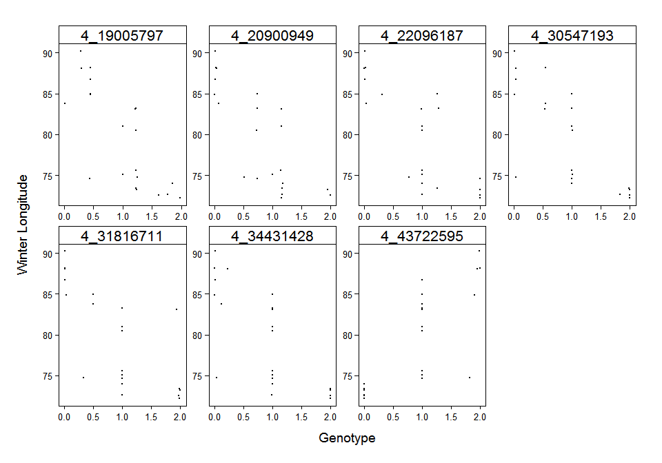

# calculate_dominance

### load libraries


```r
library(reshape2)
library(ggplot2)
library(grid)
suppressWarnings(library(tidyr))
suppressWarnings(library(knitr))
```

### load data


```r
geno <- read.csv("~/Projects/SWTH-GBS-Analysis/output/greg_new_ref_new/calc_add_chr4peak.csv")
pheno <- read.csv("~/Projects/SWTH-GBS-Analysis/gbs_red_data_trans_wspring_hybridity.csv")
winter <- data.frame(pheno$winter_long*-1)
names(winter) <- c("winter")
combo <- cbind(geno,winter)
combo <- subset(combo,combo$winter != "NA")
```

### plot winter longitude by genotype at each locus


```r
stacked <- melt(combo,id.vars=c("winter"))
stacked$variable <- gsub("^.*?\\_","",stacked$variable)

g <- ggplot(stacked,aes(value,winter))
g+
  geom_point(size=0.5)+
  labs(x = "Genotype",y = "Winter Longitude")+
  theme_bw(base_size = 20)+
  theme(
    axis.title.x = element_text(vjust=-0.75,size=14),
    axis.title.y = element_text(vjust=2.5,size=14),
    axis.text.x = element_text(colour="black",size=10),
    axis.text.y = element_text(colour="black",size=10),
    legend.position="none",
    strip.background = element_rect(fill = 'white', colour="black"),
    strip.text.y = element_text(size=8),
    plot.margin = unit(c(1, 1, 1, 1), "cm"),
    panel.grid.major = element_blank(),
    panel.grid.minor = element_blank(), 
    panel.background = element_rect(fill="white",colour="black"),
    axis.line = element_line(colour = "black"),
    panel.border = element_rect(colour = "black", fill=NA),
    panel.margin = unit(0.5, "lines"))+
  facet_wrap( ~ variable, scales="free", ncol=4)
```

<!-- -->

### estimate dominance for each locus


```r
results <- NULL

for (i in 1:(ncol(combo)-1)){
    
    homo1 <- subset(combo,combo[,i]<0.5)
    homo2 <- subset(combo,combo[,i]>1.5)
    het <- subset(combo,combo[,i]>0.5 & combo[,i]<1.5)
    
    hetmean <- mean(het$winter)
    homo1mean <- mean(homo1$winter)
    homo2mean <- mean(homo2$winter)
    
    a <- abs(homo1mean-homo2mean)/2 ## so this is the midpoint between homo1 and homo2
    
    if (homo1mean<homo2mean){ ## have to add midpoint to homo with smallest value i think
      d <- hetmean-(homo1mean+a) 
    } else {
      d <- hetmean-(homo2mean+a)
    }
    
    value <- d/a
    results<-rbind(results, cbind(names(combo[i]),value))
    
}

results <- as.data.frame(results)
names(results)<-c("locus","dominance")  
kable(results,format = "markdown",digits=2)
```


|locus                 |dominance           |
|:---------------------|:-------------------|
|locus36616_4_19005797 |-0.20248729010958   |
|locus36648_4_20900949 |-0.370106363737992  |
|locus36651_4_22096187 |-0.294894931737259  |
|locus36712_4_30547193 |0.247594472641012   |
|locus36719_4_31816711 |-0.576614282698731  |
|locus36738_4_34431428 |-0.0909537312400571 |
|locus36813_4_43722595 |0.286897582149125   |

### RESULT

additive (-0.25 to 0.25) or underdominant (-0.75 to -0.25)

i think the underdominance is for the reference (and thus probably coastal) allele but maybe  not, as i added the midpoint value to which ever homo had the smaller phenotypic value
