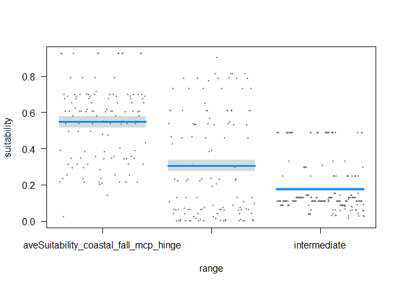

# parental_divergence
kira delmore  
`r Sys.Date()`  

Setwd, read data in and load libraries


```r
setwd("~/PhD/Analysis/Connectivity-Analysis")
id="SuitScores_allThrushes_fall"
data=read.csv(paste("C:/Users/Kira Delmore/Dropbox/Files for Julie/",id,".csv",sep=""),stringsAsFactors = FALSE,strip.white = TRUE, na.strings = c("NA",""))
library(visreg)
```

Select taxonomic group you're running and rearrange dataframe to run lm


```r
id2="coastal"
temp=subset(data,data$species==id2)
temp2=stack(temp,select=c("aveSuitability_coastal_fall_mcp_hinge","aveSuitability_inland_fall_mcp_hinge"))
names(temp2)=c("suitability","range")
temp3=subset(data,data$species%in%c("Veery","Gray-cheeked Thrush","Hermit Thrush","American Robin", "Western Bluebird", "Mountain Bluebird"))
temp4=subset(temp3,temp3$MigratoryRoute=="intermediate_route")
temp5=as.data.frame(temp4$aveSuitability_coastal_fall_mcp_hinge)
temp5[,2]="intermediate" ## MANY of these values are repeated, all from same banding station? Prob have to select only unique entries.
names(temp5)=c("suitability","range")
data_stack=rbind(temp2,temp5)
rm(list=ls(pattern="temp"))
```

Run lm


```r
z<-lm(suitability~range,data=data_stack)
anova(z)
```

```
## Analysis of Variance Table
## 
## Response: suitability
##             Df Sum Sq Mean Sq F value    Pr(>F)    
## range        2 15.356  7.6780  262.32 < 2.2e-16 ***
## Residuals 1019 29.826  0.0293                      
## ---
## Signif. codes:  0 '***' 0.001 '**' 0.01 '*' 0.05 '.' 0.1 ' ' 1
```

```r
summary(z)
```

```
## 
## Call:
## lm(formula = suitability ~ range, data = data_stack)
## 
## Residuals:
##      Min       1Q   Median       3Q      Max 
## -0.52199 -0.06360 -0.06360  0.07288  0.59739 
## 
## Coefficients:
##                                           Estimate Std. Error t value
## (Intercept)                                0.54723    0.01543   35.47
## rangeaveSuitability_inland_fall_mcp_hinge -0.24090    0.02182  -11.04
## rangeintermediate                         -0.37165    0.01660  -22.38
##                                           Pr(>|t|)    
## (Intercept)                                 <2e-16 ***
## rangeaveSuitability_inland_fall_mcp_hinge   <2e-16 ***
## rangeintermediate                           <2e-16 ***
## ---
## Signif. codes:  0 '***' 0.001 '**' 0.01 '*' 0.05 '.' 0.1 ' ' 1
## 
## Residual standard error: 0.1711 on 1019 degrees of freedom
## Multiple R-squared:  0.3399,	Adjusted R-squared:  0.3386 
## F-statistic: 262.3 on 2 and 1019 DF,  p-value: < 2.2e-16
```

```r
visreg(z)
```

 
